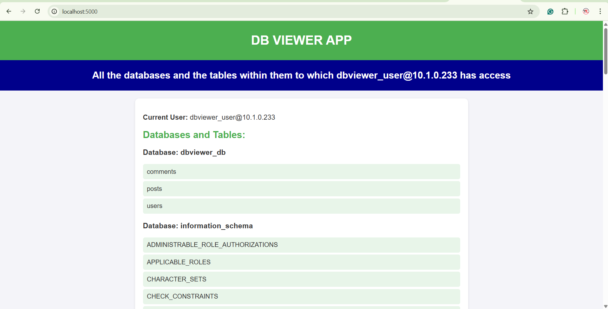

# Create Separate DB User For Each Microservice With Specific DB Restricted Access

# MySQL DB Viewer Application

This repository contains a system consisting of three main components: a Front-End Application, a Back-End MySQL Server, and a Job to create a DB user for the front-end viewer application.

## Components

### 1. Front-End Application
The front-end application is a web-based viewer that connects to the MySQL server and displays the list of databases and tables that a given user has access to. It is deployed as a web application that runs in the browser and allows users to view the databases and tables in a user-friendly interface.




#### Features:
- Displays all databases in the MySQL server.
- Lists the tables within each database.
- Shows only the databases and tables the authenticated user has access to.
- Provides a user interface to manage user access to the databases (if required).

### 2. Back-End MySQL Server
The back-end MySQL server is configured to run as a StatefulSet within Kubernetes. It stores the application’s data and provides access to the databases and tables for the front-end viewer.

#### Features:
- MySQL runs as a StatefulSet for state persistence.
- The MySQL database is accessible by the front-end application.
- The MySQL user has controlled access to databases based on privileges assigned by the system administrator.

#### Kubernetes Configuration:
- StatefulSet is used to ensure that each MySQL pod has a unique and persistent identity.
- Configured with persistent storage to ensure data retention across pod restarts.
- The MySQL server is secured with the necessary configurations and secrets management.

### 3. Job to Create DB User
This component is a Kubernetes Job designed to create a database user with the appropriate privileges for the front-end application. The user will have access to view databases and tables, and possibly manage some aspects depending on the permissions assigned.

#### Features:
- Creates a MySQL user with access to specific databases and tables.
- Configured with the necessary MySQL scripts to run once during the initial deployment.
- Ensures that the front-end application can authenticate and query the MySQL server with the correct user privileges.

# Kubernetes Microservice with MySQL User Creation

This repository contains a Kubernetes setup for deploying a microservice that handles MySQL user creation. Follow the steps below to clone the repository, navigate to the project folder, and deploy it to your Kubernetes cluster.

## Prerequisites

- Kubernetes CLI (`kubectl`) installed and configured.
- A running Kubernetes cluster.
- Git installed on your machine.

## Steps to Use

1. **Clone the Repository**

   First, clone the repository to your local machine using Git:
   ```bash
   git clone https://github.com/SaiAnilKumarDeyyala/kubernetes-microservice-mysql-user-creation

2. **Navigate to the Repository Folder**

    Change to the project directory:

        cd kubernetes-microservice-mysql-user-creation/Deployments

3. **Deploy to Kubernetes**

    Apply the Kubernetes configuration to deploy the microservice and MySQL setup:
    ```bash
        kubectl apply -f .

This will apply all the necessary Kubernetes resources, including deployments, services, and other configurations.

- After Applying you will see the following pods running:
    
